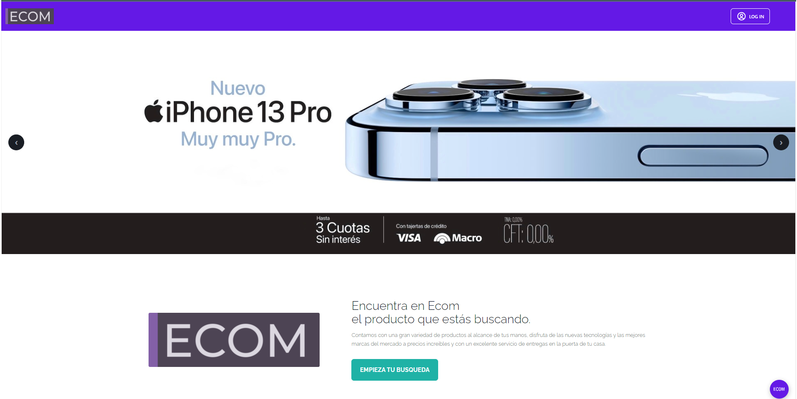
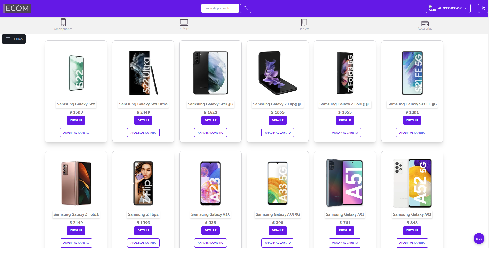
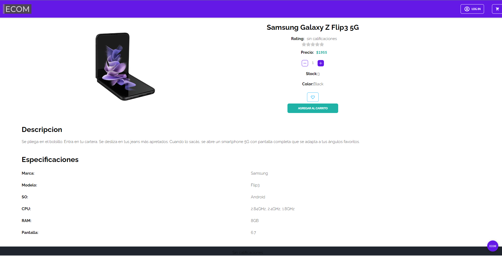
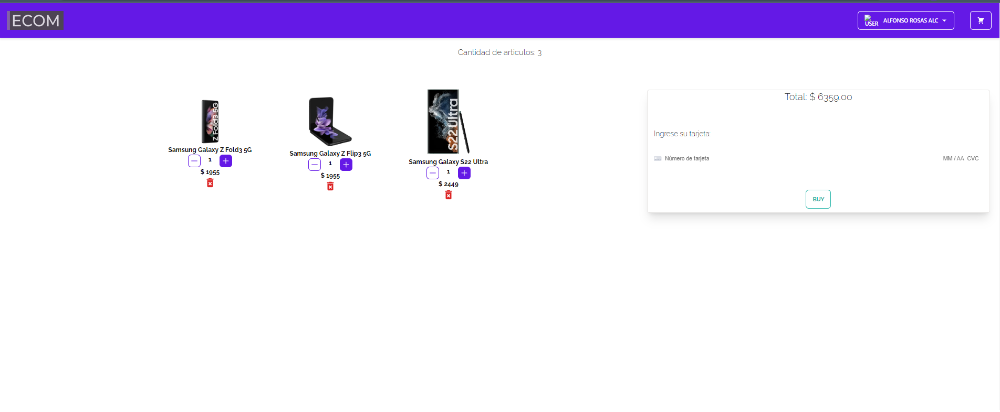

# PROYECTO FINAL ECOMMERCE.

# Feactures del Proyecto

**Se obtuvo una app completa con las siguientes features:**

✔️ Catalogo de productos

✔️ Gestión de productos (CRUD)

✔️ Gestión de categorías (CRUD)

✔️ Gestión Admnistrativa de Artículos, Usuarios, Ofertas y Estadisticas

✔️ Autenticación con terceros

✔️ Reseñas con sistema de cinco estrellas.

✔️ Sección de favoritos

✔️ Integración pasarela de pago (stripe)

✔️ Envío de emails con estado de compra

✔️ Newsletter.

✔️ Carrito de compras

✔️ Filtros por marcas, por precio, por categorias.

## Tecnologias utilizadas

<h2>🚀 Demo</h2>

[https://client-ecom-07-henry.netlify.app/](https://client-ecom-07-henry.netlify.app/)

<h2>Screenshots</h2>

  

  

  

<h3 align="center">Sobre Nosotros </h3>

 

